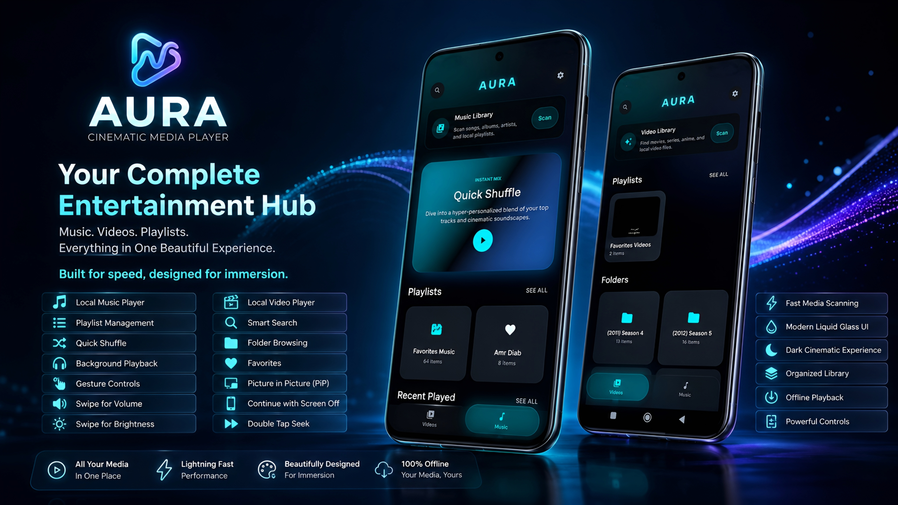

<p align="center">
  
</p>

<h1 align="center">🎬 AURA</h1>

<p align="center">
Modern Cinematic Media Player built with Flutter.
<br/>
Music. Videos. Playlists. Everything in One Beautiful Experience.
</p>

<p align="center">
  
  
  
  
</p>

---

<p align="center"> 
Please note that I am not responsible for any misuse of the application for anything forbidden.
</p>

---

## 🚀 Overview

AURA is a modern local media player built with Flutter, designed to deliver a smooth, immersive, and cinematic entertainment experience.

Whether you're listening to music, watching videos, organizing playlists, or browsing your media library, AURA combines powerful playback capabilities with a premium Liquid Glass inspired interface.

Built with performance, scalability, and user experience in mind.

---

## ✨ Features

### 🎵 Music Experience

- Local music playback
- Background audio playback
- Continue playing with screen off
- Quick Shuffle
- Favorites management
- Playlist support
- Recent played songs
- Organized music library

### 🎬 Video Experience

- Local video playback
- Picture in Picture (PiP)
- Video playlists
- Folder browsing
- Recent videos
- Fast media scanning

### 🔍 Smart Media Library

- Instant media search
- Music categorization
- Video categorization
- Organized collections
- Fast local indexing

### 🎚️ Advanced Playback Controls

- Swipe for volume control
- Swipe for brightness control
- Double tap seek
- Smooth seeking experience
- Media session integration
- Background playback support

### 🎨 Premium User Experience

- Liquid Glass inspired UI
- Cinematic dark theme
- Smooth animations
- Responsive layouts
- Modern navigation system
- Beautiful media browsing experience

---

## 🛠️ Tech Stack

| Technology | Purpose |
|------------|----------|
| Flutter | Cross-platform framework |
| Dart | Programming language |
| Flutter Bloc | State Management |
| Equatable | Value Equality |
| FP Dart | Functional Programming |
| Go Router | Navigation |
| Isar | Local Database |
| Shared Preferences | Local Storage |
| Media Kit | Video Playback |
| Media Kit Video | Video Rendering |
| Just Audio | Audio Playback |
| Just Audio Background | Background Audio |
| On Audio Query | Music Library Access |
| Photo Manager | Media Management |
| Video Thumbnail | Thumbnail Generation |
| Flutter Animate | Animations |
| Flutter ScreenUtil | Responsive UI |
| Permission Handler | Runtime Permissions |
| App Links | Deep Linking |

---

## 🏗 Architecture

AURA follows a scalable feature-based architecture designed for maintainability and future expansion.

```text
lib/
├── core/
├── features/
│   ├── music/
│   ├── video/
│   ├── playlists/
│   ├── search/
│   └── settings/
├── services/
├── widgets/
└── main.dart
```

---

## ⚡ Performance Goals

- Fast startup time
- Efficient media scanning
- Low memory consumption
- Smooth playback experience
- Offline-first architecture
- Optimized media indexing

---

## 🎯 Roadmap

### Upcoming Features

- 🎤 Lyrics Support
- 🎚️ Equalizer
- 😴 Sleep Timer
- 🎨 Material You Integration
- 📺 Android TV Support
- 📡 Chromecast Support
- ☁️ Cloud Backup & Restore
- 🎭 Custom Themes

---

# 📦 Installation

Clone the repository:

```bash
git clone https://github.com/20Mahmoud06/AURA.git
```

Navigate to the project directory:

```bash
cd AURA
```

Install dependencies:

```bash
flutter pub get
```

Run the application:

```bash
flutter run
```

---
## 🤝 Contributing

Contributions, feature requests, and improvements are always welcome.

Feel free to fork the repository and submit a pull request.

---

## 📜 License

MIT License

---

# 👨‍💻 Developer

### Mahmoud Safa

Flutter Developer passionate about building high-performance mobile applications with modern UI/UX and clean architecture.

---

<p align="center">
Built with ❤️ by Mahmoud Safa
</p>
